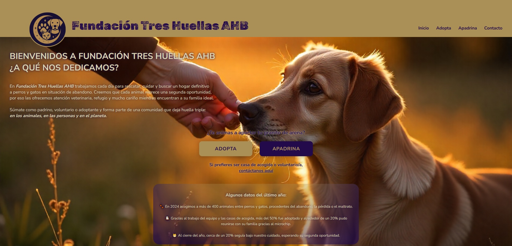

# 🐾 Web Protectora de Animales — Fundación Tres Huellas AHB

Práctica de **HTML y CSS** desarrollada en el módulo de **Lenguaje de Marcas** (1º DAM · Curso 2025/2026).

---

## 🖼️ Vista previa



<a href="https://web-protectora.vercel.app" target="_blank"></a>

---

## 📋 Descripción

Sitio web estático de varias páginas para una fundación ficticia de protección animal llamada **Fundación Tres Huellas AHB**. La web permite a los usuarios conocer los animales disponibles para adopción y apadrinamiento, así como contactar con la fundación.

El proyecto se centró en aplicar correctamente la estructura semántica de HTML5 y el diseño visual con CSS puro, sin frameworks.

---

## 📄 Páginas

| Archivo | Descripción |
|---|---|
| `Home.html` | Página principal con presentación de la fundación y botones de navegación |
| `Adopta.html` | Galería de perros y gatos disponibles para adopción |
| `Apadrina.html` | Listado de animales disponibles para apadrinar |
| `Contacto.html` | Formulario de contacto |

Cada página tiene su propia hoja de estilos vinculada (`estiloHome.css`, `estiloAdopta.css`, `estiloApadrina.css`, `estiloContacto.css`).

---

## 🛠️ Tecnologías


---

## ✨ Características aplicadas

- Estructura semántica con `<header>`, `<main>`, `<section>`, `<nav>`, `<footer>`
- Navegación entre páginas con enlaces relativos
- Galería de imágenes de animales
- Formulario de contacto con campos de texto, email y textarea
- Estilos personalizados por página con CSS (colores, tipografía, layout)
- Diseño adaptado a escritorio

---

## 📁 Estructura del proyecto

```
Web Protectora/
├── Home.html
├── Adopta.html
├── Apadrina.html
├── Contacto.html
├── estiloHome.css
├── estiloAdopta.css
├── estiloApadrina.css
├── estiloContacto.css
├── Adopciones Gatos/       ← Imágenes de gatos
├── Adopciones Perros/      ← Imágenes de perros
├── Apadrinar/              ← Imágenes para apadrinar
└── assets/                 ← Capturas de pantalla del README
```

---

## 🎓 Contexto académico

> Práctica de la asignatura **Lenguaje de Marcas** · 1º DAM · 2025/2026
